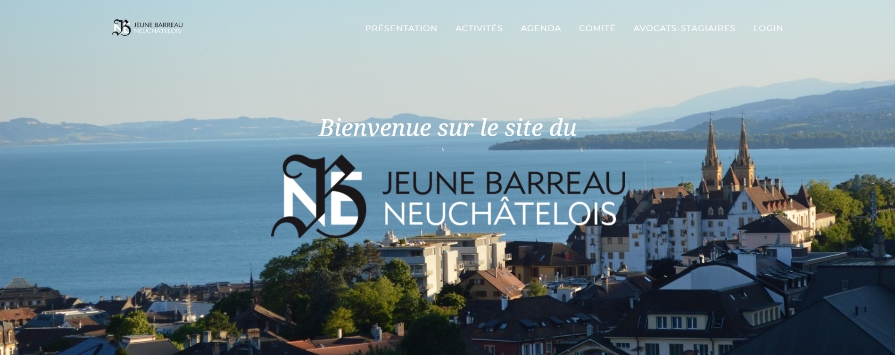

# JBNE - Jeune Barreau neuchâtelois

Site réalisé avec [Laravel 5.4](https://laravel.com/docs/5.4/), à partir du template bootstrap [Agency](https://startbootstrap.com/template-overviews/agency/)




To install Laravel dependencies (`vendor` folder):
```bash
composer install
```

To install Vue dependencies (`node_modules` folder):
```bash
npm install
```

Specify application encryption key:
```bash
php artisan key:generate
```

To compile vue assets:
```bash
npm run watch
# Then visit http://127.0.0.1:8000/
```

To migrate DB tables:
```bash
php artisan migrate
```

To seed DB tables:
```bash
php artisan db:seed
```

To lunch dev environment:
```bash
php artisan serve
```

then visit localhost:8000
or with Laravel Valet visit jbne.test


To install external libraries:
``` bash
php ../../composer.phar update
```


## Package errors

unisharp/laravel-filemanager

```bash
In file LfmHelpers.php, replace this line
	return lcfirst(str_singular(request('type'))) === 'image';

by this one:
	return lcfirst(str_singular(request('type') ?: '')) === 'image';
```


## Author
[Jean-Marc Kleger](http://www.jmkleger.com)


